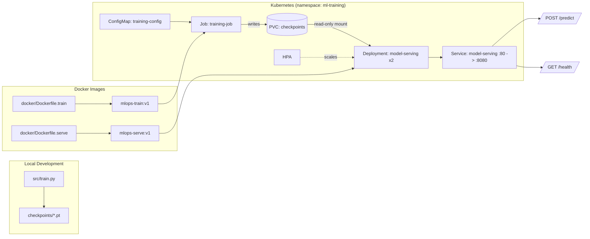

# mlops-pytorch-pipeline

A production-style ML pipeline that trains a PyTorch image classifier (ResNet-18 on CIFAR-10) and serves it, containerized with Docker and orchestrated with Kubernetes.

## Architecture



**Flow:** train locally or as a Kubernetes `Job` → checkpoint written to a shared `PersistentVolumeClaim` → serving `Deployment` mounts the same PVC read-only → `Service` exposes the REST API → `HorizontalPodAutoscaler` scales replicas under load.

## Project Structure

```
mlops-pytorch-pipeline/
├── README.md
├── .gitignore
├── .github/workflows/ci.yml
├── src/
│   ├── train.py        # training loop, JSON-lines logging, early stopping
│   ├── model.py         # ResNet-18 classifier factory
│   ├── dataset.py       # CIFAR-10 dataloaders
│   └── serve.py         # Flask inference API
├── configs/
│   └── training_config.yaml
├── docker/
│   ├── Dockerfile.train
│   └── Dockerfile.serve
├── k8s/
│   ├── namespace.yaml
│   ├── configmap.yaml
│   ├── training-job.yaml
│   ├── serving-deployment.yaml
│   ├── serving-service.yaml
│   └── hpa.yaml
├── requirements/
│   ├── train.txt
│   └── serve.txt
└── tests/
    └── test_model.py
```

## Setup

### Prerequisites
- Python 3.10+
- Docker Desktop
- kubectl + a local cluster (Minikube)

### Local training

```bash
python -m venv .venv && .venv\Scripts\activate   # Windows
pip install -r requirements/train.txt
python src/train.py   # reads configs/training_config.yaml
```

### Local serving

```bash
pip install -r requirements/serve.txt
python src/serve.py   # loads checkpoints/classifier_v1.pt
```

### Docker

```bash
docker build -f docker/Dockerfile.train -t mlops-train:v1 .
docker run --rm -v ${PWD}/data:/app/data -v ${PWD}/checkpoints:/app/checkpoints mlops-train:v1

docker build -f docker/Dockerfile.serve -t mlops-serve:v1 .
docker run --rm -p 8080:8080 -v ${PWD}/checkpoints:/app/checkpoints mlops-serve:v1

curl -X POST http://localhost:8080/predict -F "image=@test_image.png"
```

### Kubernetes

```bash
kubectl apply -f k8s/namespace.yaml
kubectl apply -f k8s/configmap.yaml
kubectl apply -f k8s/training-job.yaml

kubectl apply -f k8s/serving-deployment.yaml
kubectl apply -f k8s/serving-service.yaml
kubectl apply -f k8s/hpa.yaml

kubectl get pods -n ml-training
kubectl port-forward svc/model-serving 8080:80 -n ml-training
curl -X POST http://localhost:8080/predict -F "image=@test_image.png"
```

## Git Workflow

- `main` — stable, releases only
- `develop` — integration branch
- `feature/*` — one branch per unit of work, merged into `develop` via PR
- `develop` → `main` via a final release PR once validated end-to-end

## CI

`.github/workflows/ci.yml` runs lint/tests on every push and PR.
